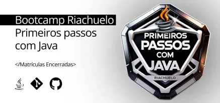

#### BOOTCAMP RIACHUELO - PRIMEIROS PASSOS COM JAVA
Repositório para implementação e estudo dos códigos desenvolvidos durante o **Bootcamp Riachuelo - Primeiros Passos com Java**, oferecido em parceria com a plataforma de ensino **Digital Innovation One (DIO)**.

#### Links

- [Digital Innovation One (DIO)](https://www.dio.me)
- [Bootcamp Riachuelo - Primeiros Passos com Java](https://www.dio.me/bootcamp/riachuelo-primeiros-passos-com-java)

#### Conceitos Desenvolvidos

**OBS**: Os códigos referentes ao estudo dos conceitos de Java estão disponíveis no repositório da [Formação Java Fundamentals](https://github.com/astorti/formacao-java-fundamentals-DIO), realizado através da plataforma de ensino Digital Innovation One - DIO.

[**Fundamentos da Linguagem Java**](#fundamentos-java) |
[**Estruturas de Controle**](#estruturas-controle) |
[**Programação Orientada a Objetos**](#programacao-orientada-objetos) |
[**Estruturas de Dados**](#estruturas-dados) |
[**Classes**](#classes) |
[**Enumeration**](#enumeration) |
[**Desafios de Códigos**](#desafios-codigos) |

- [**Fundamentos da Linguagem Java**](https://github.com/astorti/formacao-java-fundamentals-DIO/tree/main/BasicoJava/Fundamentos)
    
    keywords, tipos primitivos, operadores (atribuição, lógicos, aritméticos), função Math, incremento e decremento, bitwise.

- [**Estruturas de Controle**](https://github.com/astorti/formacao-java-fundamentals-DIO/tree/main/BasicoJava/EstruturasControle)

    condicionais, switch-case, for, while, do-while

- [**Programação Orientada a Objetos**](https://github.com/astorti/formacao-java-fundamentals-DIO/tree/main/ProgramacaoOrientadaObjetos)

    Classes, Record, Encapsulamento, Herança, Polimorfismo,  Interfaces

- [**Estruturas de Dados**](https://github.com/astorti/formacao-java-fundamentals-DIO/tree/main/EstruturaDados)

    List, Arrays, Set, Map, Wrappers

- [**Classes**](https://github.com/astorti/formacao-java-fundamentals-DIO/tree/main/Classes)

    String, StringBuilder, StringBuffer, BigDecimal, Optional, Streams, Generics, Date, Calendar, LocalDate, LocalTime, LocalDateTime, OffsetDateTime

- [**Enumaration**](https://github.com/astorti/formacao-java-fundamentals-DIO/tree/main/Enumeration)

    Enumeration

- **Desafios de Códigos**

    - **Desafio 01: Promoção Relâmpago:** Na loja de departamentos "SuperCompras", o gerente decidiu fazer uma promoção especial. Dependendo do valor da compra, os clientes receberão diferentes descontos. Sua missão é implementar um programa que determine o desconto aplicado com base no valor gasto! **Entrada**: A entrada deve receber uma string representando o valor da compra em reais, utilizando duas casas decimais. O valor será sempre positivo e não conterá caracteres especiais. **Saída**: Deverá retornar uma string informando o desconto aplicado. 
    
        As regras são:
        - se o valor for menor que 50, o desconto é de 0%. 
        - se estiver entre 50 e 100, o desconto é de 10%. 
        - acima de 100, o desconto é de 20%.

        

    - **Desafio 02: Organizando Estoque:** Você é o novo gerente de uma rede de lojas de departamento e precisa organizar o estoque de produtos. Cada loja possui um código único e você deve calcular o total de produtos disponíveis em cada uma delas. Aceite o desafio e ajude a empresa a otimizar seu estoque! **Entrada**: A entrada deve receber uma string contendo os códigos das lojas e a quantidade de produtos, separados por vírgulas. Cada loja e sua quantidade devem ser representadas no formato "codigo:quantidade". A entrada terá no máximo 1000 caracteres. **Saída**: Deverá retornar uma string com os códigos das lojas e o total de produtos disponíveis em cada uma, no formato "codigo:total", separados por vírgulas.

        

    - **Desafio 03: Cadastro de Cliente da Loja:** Uma loja de roupas está começando a criar um sistema para cadastrar clientes. Você deve criar uma classe chamada Cliente que armazene as informações nome e email. Depois, o programa deve instanciar um objeto dessa classe usando os dados fornecidos pelo usuário e exibir uma mensagem de boas-vindas para o cliente. **Entrada**: O programa deve receber os seguintes dados, digitados na mesma linha e separados por espaços: **Nome do cliente** (String, apenas uma palavra) e **Email do cliente** (String). **Saída**: O programa deve exibir uma mensagem de boas-vindas no seguinte formato: **Cliente _nome_ cadastrado com sucesso! Email: _email_**.

        

    - **Desafio 04: Cadastro de Produtos:** Uma loja de roupas está modernizando seu sistema e deseja registrar seus produtos de forma organizada. Para isso, você deve criar uma classe chamada **Produto** com três atributos: **nome**, **preco** e **categoria**. O programa deverá ler os dados do produto (nome, preço e categoria) fornecidos pelo usuário, criar um objeto da classe Produto com esses valores e, por fim, exibir as informações em uma única linha, seguindo o formato estabelecido. **Entrada**: O programa deve receber os seguintes dados: *nome do produto*, *preço do produto* e *categoria do produto*. **Saída**: O programa deve exibir uma única linha com as informações do produto formatadas, seguindo exatamente o modelo: **Produto: _nome_ | Categoria: _categoria_ | Preco: R$ _preco_**. O nome e a categoria devem aparecer exatamente como foram digitados. O preço deve ser exibido  com ponto decimal e duas casas decimais, como foi inserido na entrada.

- **Desafios de Projetos**

    - **JavaBank**: Projeto desenvolvido em acompanhamento da aula, em que foi implementada uma aplicação que simula um sistema bancário, sendo possível realizar a criação de contas, depósitos, saques, transferências via PIX, criação de investimentos e acompanhamento de histórico de transações. O objetivo deste projeto foi aprofundar os conceitos relacionados a Programação Orientada a Objetos, como herança, encapsulamento, polimorfismo, abstração e reuso de código. Como desafio pessoal neste projeto, optou-se em desenvolver os getters manualmente, ao contrário do projeto desenvolvido em aula ([Github Projeto DIO](https://github.com/digitalinnovationone/java-bank)), que foi criado com a ferramenta Gradle e utilizada a biblioteca Lombok.

        Acessar projeto [**JavaBank**](https://github.com/astorti/Bootcamp-Riachuelo-Primeiros-Passos-com-Java-DIO/tree/main/DesafiosDeProjeto/JavaBank)

